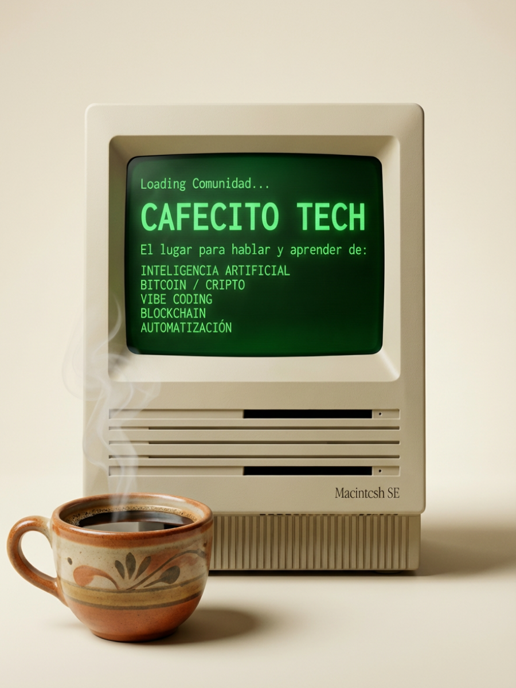

# Cafecito Tech Landing Page

El primer networking de tecnologia para latinos en Charlotte.



## Descripcion

**Cafecito Tech** es un evento de networking casual creado para conversar sobre tecnologia en espanol. Este landing page presenta el evento, los fundadores, y conecta a la comunidad latina de Charlotte con recursos tecnologicos.

### Caracteristicas

- **Hero Section** - Imagen retro Macintosh SE con efecto blend
- **Ticker Animado** - Barra estilo terminal con temas tech (AI, Bitcoin, Automation, etc.)
- **Secciones Informativas** - Que es, Por que ir, Agenda, Es para ti
- **Calendario de Eventos** - Proximos eventos con registro via Luma
- **Seccion Fundadores** - Historia y mision de Cafecito Tech
- **Blog Section** - Articulos de Link Foundation con scroll horizontal
- **i18n Completo** - Soporte Espanol/Ingles con toggle
- **Responsive Design** - Mobile-first, optimizado para todos los dispositivos

## Tech Stack

- **HTML5** - Semantico y accesible
- **CSS3** - Custom properties, Flexbox, Grid, Animations
- **JavaScript** - Vanilla ES6+ (sin frameworks)
- **Fonts** - Space Grotesk, Inter, IBM Plex Mono (Google Fonts)

## Estructura del Proyecto

```
cafecito-tech-landing/
├── index.html              # Pagina principal
├── css/
│   ├── variables.css       # Design tokens y CSS custom properties
│   ├── reset.css           # CSS reset/normalize
│   ├── components.css      # Componentes reutilizables (botones, cards, etc.)
│   ├── sections.css        # Estilos especificos por seccion
│   └── responsive.css      # Media queries y responsive design
├── js/
│   └── main.js             # Interactividad, i18n, animaciones
├── assets/
│   └── images/             # Imagenes del sitio
├── vercel.json             # Configuracion de Vercel
└── README.md               # Este archivo
```

## Desarrollo Local

```bash
# Opcion 1: Abrir directamente en el navegador
open index.html

# Opcion 2: Servidor local con Python
python3 -m http.server 8080

# Opcion 3: Servidor local con Node
npx serve .
```

Luego visita `http://localhost:8080`

## Deploy

### Vercel (Recomendado)

```bash
# Instalar Vercel CLI
npm i -g vercel

# Deploy a produccion
vercel --prod
```

O conecta el repositorio directamente en [vercel.com](https://vercel.com) para deploys automaticos en cada push.

### Otros servicios

El sitio es estatico puro, compatible con:
- GitHub Pages
- Netlify
- Cloudflare Pages
- Cualquier hosting estatico

## Configuracion

### Actualizar Eventos

Edita las event cards en `index.html` seccion `#eventos`:

```html
<article class="event-card">
  <span class="event-card__badge">FECHA</span>
  <h3 class="event-card__title">Titulo del Evento</h3>
  <!-- ... -->
</article>
```

### Cambiar Idioma por Defecto

En `js/main.js`, modifica:

```javascript
let currentLang = localStorage.getItem('cafecito-lang') || 'es'; // 'es' o 'en'
```

### Agregar Traducciones

Las traducciones estan en el objeto `translations` en `js/main.js`:

```javascript
const translations = {
  es: {
    'key.name': 'Texto en espanol',
  },
  en: {
    'key.name': 'Text in English',
  }
};
```

## Design System

### Colores Principales

| Variable | Color | Uso |
|----------|-------|-----|
| `--color-cream` | #F4EEE1 | Background principal |
| `--color-brown` | #8B7355 | Texto y acentos |
| `--color-brown-dark` | #5C4A3A | Headers, footer |
| `--color-crt-green` | #33FF33 | CTAs, efectos retro |

### Tipografia

- **Headings**: Space Grotesk (bold, semi-bold)
- **Body**: Inter (regular, medium)
- **Mono**: IBM Plex Mono (codigo, badges, ticker)

## Links

- **Evento**: [lu.ma/7b6ykm3k](https://lu.ma/7b6ykm3k)
- **Link Foundation**: [linkfoundation.io](https://linkfoundation.io)
- **Blog**: [linkfoundation.io/blog](https://linkfoundation.io/blog)

## Contribuir

1. Fork el repositorio
2. Crea una rama (`git checkout -b feature/nueva-funcionalidad`)
3. Commit tus cambios (`git commit -m 'Agrega nueva funcionalidad'`)
4. Push a la rama (`git push origin feature/nueva-funcionalidad`)
5. Abre un Pull Request

## Licencia

Este proyecto es de [Link Foundation](https://linkfoundation.io).

---

Hecho con ☕ y 💚 en Charlotte, NC

**Una iniciativa de Link Foundation** - Empowering the Latino Community Through Technology
